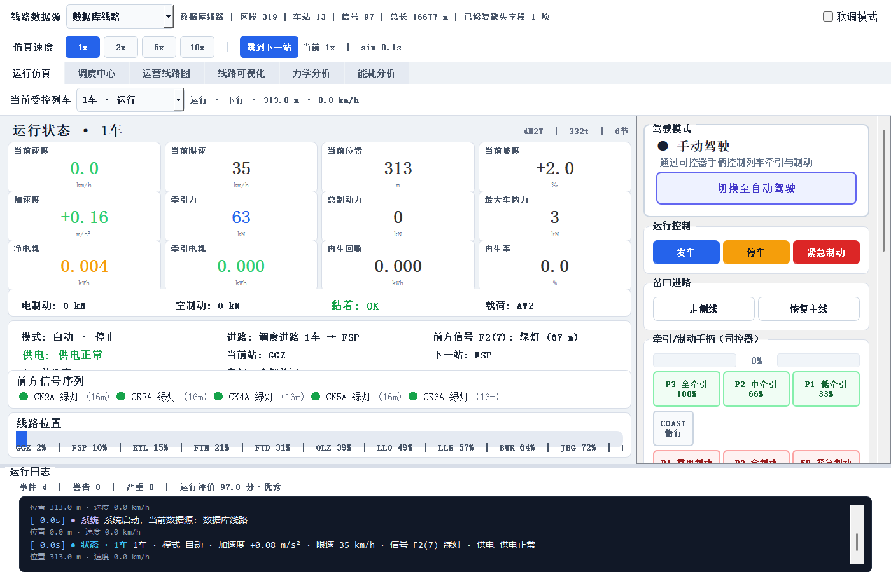
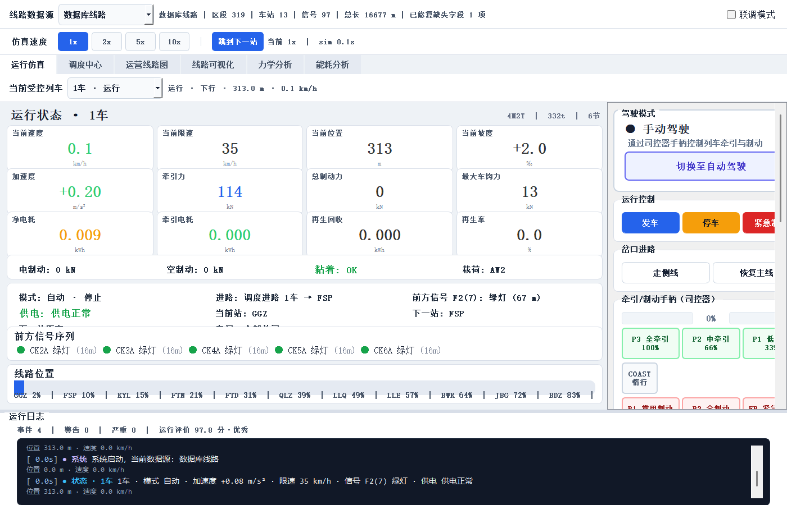
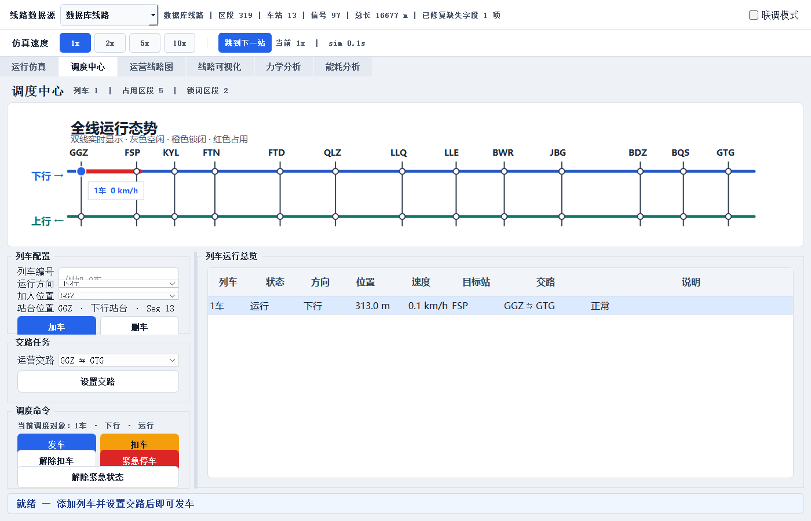
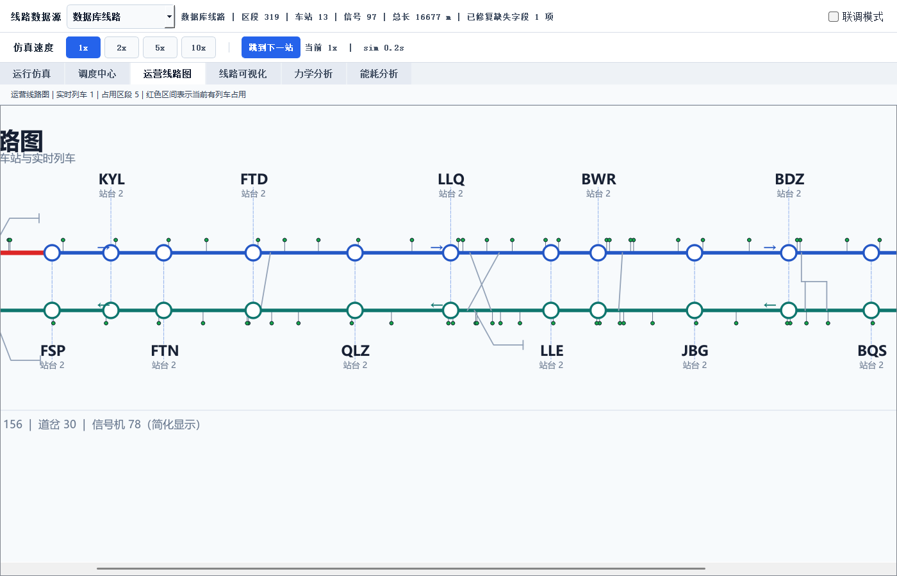
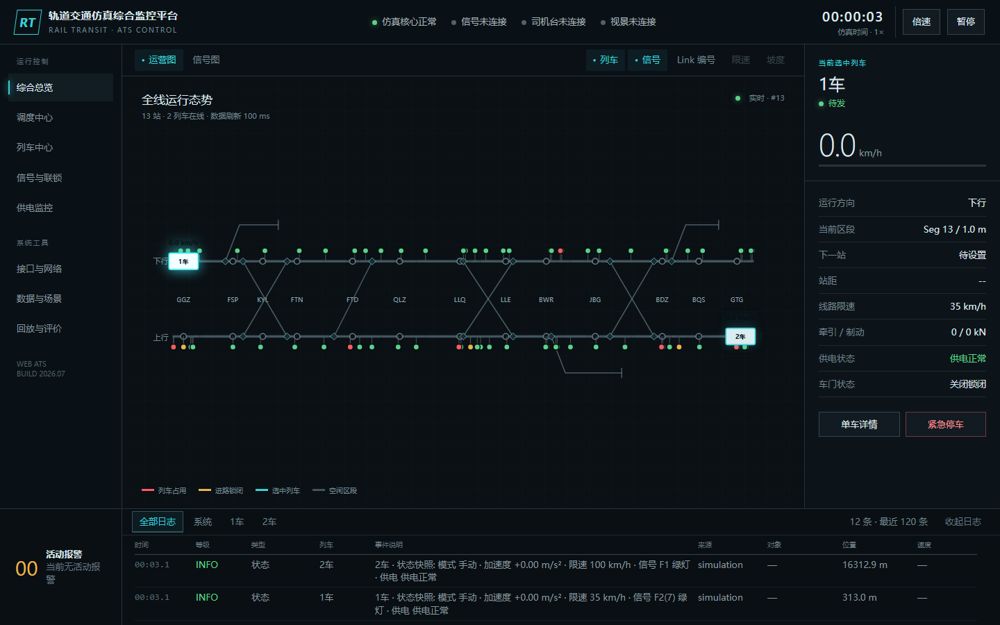
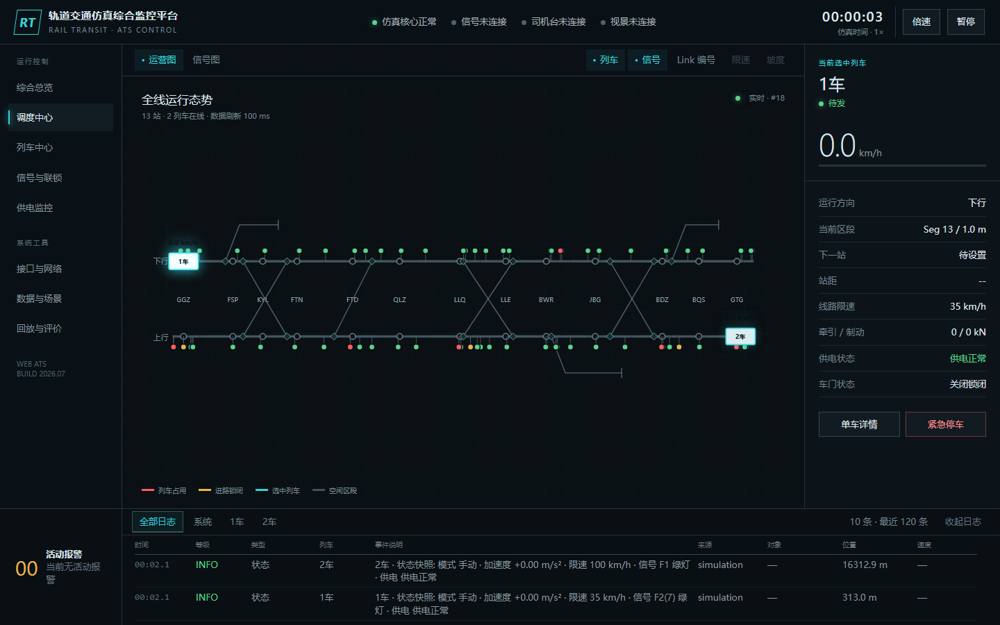
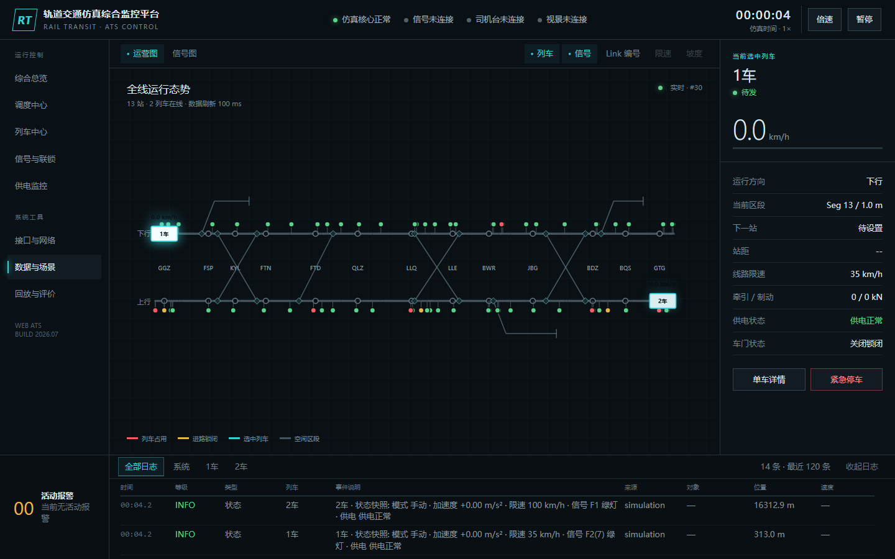
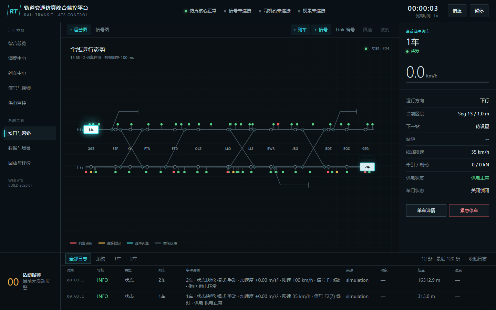
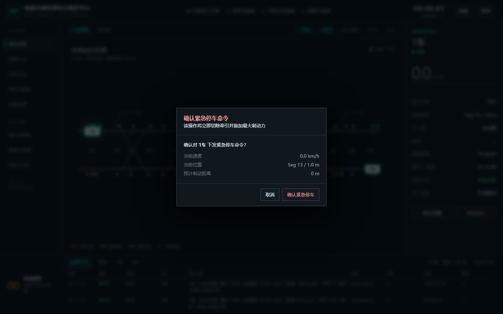

# 轨道交通模拟系统 — 黑盒测试用例

> 设计方法：等价类划分（EP）、边界值分析（BVA）、场景法、判定表、错误推测。  
> 截图路径相对本目录：`screenshots/`。  
> 用例编号：`TC-Dxx` = 桌面 Qt；`TC-Wxx` = Web ATS；`TC-Axx` = API。

---

## 用例汇总表

| 编号 | 标题 | 方法 | 优先级 | 预期 |
|------|------|------|--------|------|
| TC-D01 | 桌面程序正常启动 | 场景 | P0 | 主窗口可见，各 Tab 存在 |
| TC-D02 | 手动驾驶面板可用 | EP | P0 | 可见司控器与运行控制 |
| TC-D03 | 无牵引静止驻车（BVA v≈0） | BVA / 错误推测 | P0 | 不溜车 |
| TC-D04 | 全牵引列车前进 | EP | P0 | 速度/里程增加 |
| TC-D05 | 调度中心界面 | 场景 | P0 | 调度页可加车操作区可见 |
| TC-D06 | 车门联锁判定表 | 判定表 | P1 | 运行中禁开门 |
| TC-D07 | 线路可视化显示 | 场景 | P1 | 线路/列车可见 |
| TC-D08 | 岔口进路「走侧线」 | EP / 错误推测 | P1 | 状态提示设定成功 |
| TC-D09 | 岔口进路「恢复主线」 | EP | P1 | 清除岔口设定 |
| TC-D10 | 倍速边界 1x/10x | BVA | P2 | 切换有效 |
| TC-W01 | Web ATS 首页总览 | 场景 | P0 | 运营图加载 |
| TC-W02 | Web 调度控制页 | 场景 | P0 | 调度页打开 |
| TC-W03 | Web 场景页 | EP | P1 | 场景列表可见 |
| TC-W04 | Web 接口通信页 | 场景 | P1 | 接口状态可见 |
| TC-W05 | 紧急停车确认框 | 场景 / 错误推测 | P0 | 弹窗确认可取消 |
| TC-A01 | health API | EP | P0 | `ok: true` |
| TC-A02 | snapshot API | EP | P0 | 含 line/trains 结构 |

---

## 详细用例

### TC-D01 桌面程序正常启动

| 项 | 内容 |
|----|------|
| 方法 | 场景法（主成功路径） |
| 前置 | 已安装依赖；当前目录为项目根；`PYTHONPATH=.` |
| 步骤 | 1. 执行 `python src\main.py`  2. 等待主窗体出现  3. 观察顶部数据源与 Tab |
| 期望 | 窗口标题/主框架正常；存在「运行仿真」「调度中心」等 Tab；无崩溃 |
| 实际结果 | （执行后填写）□通过 □失败 |
| 截图 |  |

---

### TC-D02 手动驾驶面板可用

| 项 | 内容 |
|----|------|
| 方法 | 等价类：手动模式有效类 |
| 前置 | TC-D01 通过；位于「运行仿真」 |
| 步骤 | 1. 查看右侧控制区  2. 确认「运行控制」「牵引/制动手柄」「岔口进路」分组 |
| 期望 | 发车/停车/紧急制动可见；手柄档位可见；岔口「走侧线/恢复主线」可见 |
| 实际结果 | （执行后填写） |
| 截图 |  |

---

### TC-D03 无牵引静止驻车（边界：速度≈0）

| 项 | 内容 |
|----|------|
| 方法 | **边界值分析**（v=0 边界）+ **错误推测**（历史缺陷：启动即溜车） |
| 前置 | 数据库线路；列车停稳；手柄惰行/零位 |
| 步骤 | 1. 不给牵引不按发车  2. 观察 5–10 秒仪表速度与里程 |
| 期望 | 速度保持 ≈0 km/h；里程无明显持续增大（允许浮点抖动 <0.5 m） |
| 实际结果 | （执行后填写） |
| 截图 |  |

**等价类补充：**

| 类 | 输入 | 预期 |
|----|------|------|
| 有效 | throttle=0, brake=0, v≈0 | 驻车 |
| 有效 | throttle>0 | 可加速 |
| 无效/异常 | 门开且请求牵引 | 拒牵（见 TC-D06） |

---

### TC-D04 全牵引列车前进

| 项 | 内容 |
|----|------|
| 方法 | 等价类：牵引有效类 |
| 前置 | 门已关；可发车 |
| 步骤 | 1. 关门  2. 点「发车」或手柄拉牵引  3. 观察速度与位置抬头 |
| 期望 | 速度升高；位置里程增大；力学/仪表有刷新 |
| 实际结果 | （执行后填写） |
| 截图 |  |

---

### TC-D05 调度中心界面

| 项 | 内容 |
|----|------|
| 方法 | 场景法 |
| 前置 | TC-D01 |
| 步骤 | 1. 切换 Tab「调度中心」  2. 查看列车列表/加车区 |
| 期望 | 调度界面渲染成功；可选择车站/方向（具体控件以当前 UI 为准） |
| 实际结果 | （执行后填写） |
| 截图 |  |

**主成功场景（加车发车）：**

```
加车 → 选交路 → 发车 → 列车运行 →（可选）扣车/紧急停车
```

异常分支：区段占用时加车失败应有提示（错误推测）。

---

### TC-D06 车门联锁（判定表）

| 项 | 内容 |
|----|------|
| 方法 | **判定表** |
| 前置 | 运行仿真页 |

**判定表：**

| 规则 | R1 | R2 | R3 | R4 |
|------|----|----|----|----|
| 速度 > 0.5 m/s | Y | Y | N | N |
| 请求开门 | Y | N | Y | N |
| 期望 | 禁止开门 | — | 允许开门（站台侧匹配） | — |

| 规则 | R5 | R6 |
|------|----|----|
| 门开 | Y | N |
| 请求发车/牵引 | Y | Y |
| 期望 | 拒绝发车 | 允许（其它条件满足时） |

| 步骤 | 选一条规则手动复核（建议 R1：运行后点开门，应提示禁止） |
| 截图 | 可复用 `TC-D04` 运行态 + 自行补「禁止开门」提示图 `TC-D06_door_interlock.png`（手工补拍） |

---

### TC-D07 线路可视化显示

| 项 | 内容 |
|----|------|
| 方法 | 场景法 |
| 步骤 | 打开「线路可视化」或「运营线路图」Tab |
| 期望 | 轨道图形绘制；可见列车位置或状态栏统计 |
| 截图 |  |

---

### TC-D08 / TC-D09 岔口进路

| 编号 | 步骤 | 期望 | 截图建议 |
|------|------|------|----------|
| TC-D08 | 点「走侧线」 | 状态栏提示已设定前方岔口→侧线 | 可在 TC-D02 图基础上手工框选标注，或补拍 `TC-D08_lateral_fork.png` |
| TC-D09 | 点「恢复主线」 | 提示已清除岔口设定 | 补拍 `TC-D09_clear_fork.png` |

方法：等价类（有侧线/无侧线）；错误推测（避免扫到全线第一个而非前方岔口）。

---

### TC-D10 仿真倍速边界

| 项 | 内容 |
|----|------|
| 方法 | **边界值**：最小 1x，常见 2/5，最大 10x |
| 步骤 | 依次点击 1x → 10x → 1x |
| 期望 | 按钮选中态切换；仿真节奏变化可感知 |
| 截图 | 手工补拍顶部倍速条 `TC-D10_speed_multiplier.png` |

---

### TC-W01 Web ATS 首页总览

| 项 | 内容 |
|----|------|
| 前置 | `uvicorn src.web.app:app --host 127.0.0.1 --port 8765` |
| 步骤 | 浏览器打开 `http://127.0.0.1:8765/` |
| 期望 | 「轨道交通仿真综合监控平台」；运营图非长期空白；后端连接成功态 |
| 截图 |  |

---

### TC-W02 Web 调度控制页

| 步骤 | 侧栏点「调度控制」 |
| 期望 | 调度相关表单/列表出现 |
| 截图 |  |

---

### TC-W03 Web 场景页

| 方法 | 等价类：场景类型（normal / low_voltage / power_outage / …） |
| 步骤 | 侧栏「数据与场景」 |
| 期望 | 可选场景条目展示 |
| 截图 |  |

---

### TC-W04 Web 接口通信页

| 步骤 | 侧栏「接口通信」 |
| 期望 | 各接口连接状态区域可见 |
| 截图 |  |

---

### TC-W05 紧急停车确认框

| 方法 | 场景法 + 错误推测（误触应可取消） |
| 步骤 | 1. 总览页点「紧急停车」 2. 观察确认对话框 3. 点取消 |
| 期望 | 出现确认层；取消后不执行紧急制动或回到原界面 |
| 截图 |  |

---

### TC-A01 / TC-A02 API 冒烟

| 编号 | 请求 | 期望 |
|------|------|------|
| TC-A01 | `GET /api/health` | JSON 含 `"ok": true` |
| TC-A02 | `GET /api/snapshot` | 含线路/列车相关字段；HTTP 200 |

可用浏览器或：

```cmd
curl http://127.0.0.1:8765/api/health
curl http://127.0.0.1:8765/api/snapshot
```

截图：将响应窗口另存为 `TC-A01_health.png` / `TC-A02_snapshot.png`（手工或脚本）。

---

## 手工补拍清单（自动化可能覆盖不全）

若自动截图脚本未生成某文件，请按上表文件名补拍到 `screenshots/`：

- [ ] TC-D06_door_interlock.png  
- [ ] TC-D08_lateral_fork.png  
- [ ] TC-D09_clear_fork.png  
- [ ] TC-D10_speed_multiplier.png  
- [ ] TC-A01_health.png  
- [ ] TC-A02_snapshot.png  

采集命令：

```cmd
cd /d C:\Users\Derek8571\Desktop\小学期实训\Rail-Transit-Practice-3
set PYTHONPATH=.
python scripts\capture_blackbox_screenshots.py
```
